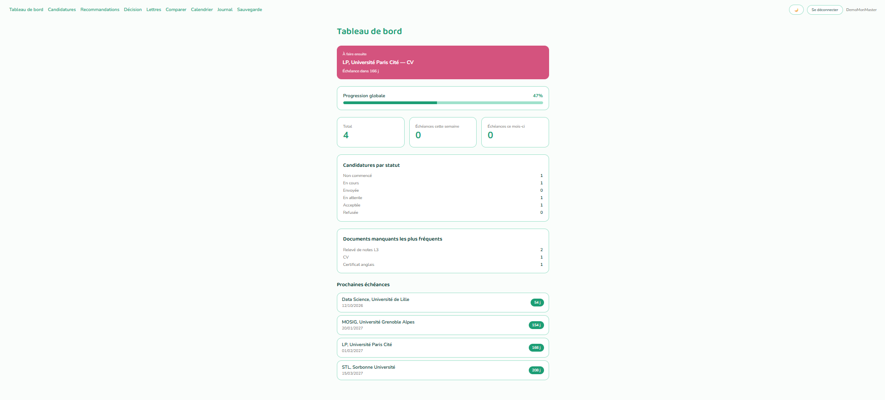
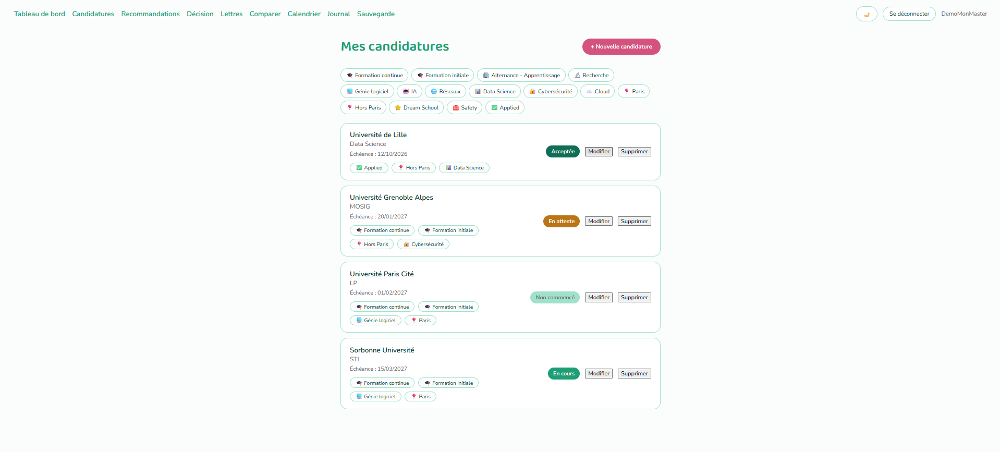
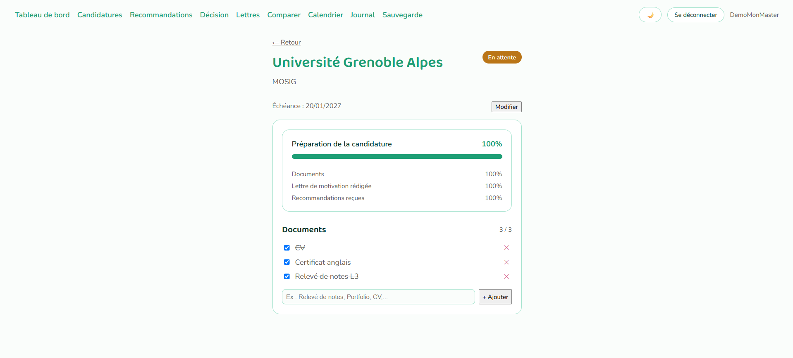
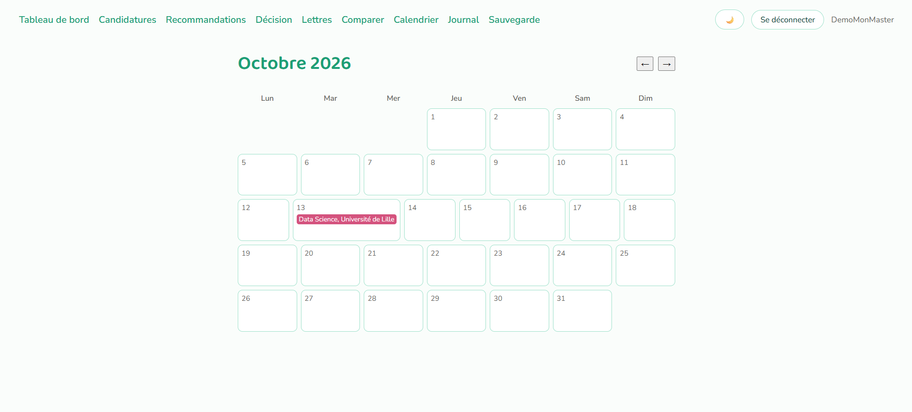

# MonMaster Companion

Application de suivi de candidatures aux masters en France : tableau de bord,
checklist de documents par candidature, calendrier des échéances, gestionnaire
de versions de lettres de motivation avec comparaison, aide à la décision par
pondération transparente (pas d'IA), journal de candidature, et sauvegarde de données.

Démo en ligne : https://mon-master-companion.vercel.app

## Documentation

- DESIGN : choix d'architecture du projet
- LICENSE : licence du projet
- [monmaster-api](https://github.com/bianca574/mon-master-api) : dépôt de l'API backend

## Aperçu






## Compte de démonstration

Pour explorer l'application sans créer de compte :

- Email : `demo@monmaster.app`
- Mot de passe : `DemoMonMaster2026`

## Stack technique

- React 18 + Vite
- React Router
- Vitest (tests)
- GitHub Actions (lint, build, test)
- Déployé sur Vercel

## Lancer le projet en local

Prérequis : Node 20+, et l'API backend accessible (voir le dépôt
[monmaster-api](https://github.com/bianca574/mon-master-api)).

```bash
npm install
cp .env.example .env.local
npm run dev
```

Par défaut, `VITE_API_BASE` pointe vers `http://localhost:3001`. Modifier
`.env.local` si l'API tourne ailleurs.

## Tests

```bash
npm run test
```

## Build

```bash
npm run build
```

## Lint

```bash
npm run lint
```
